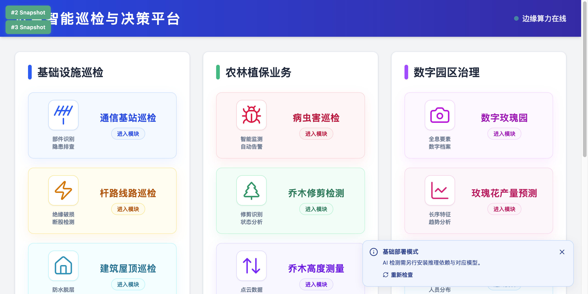
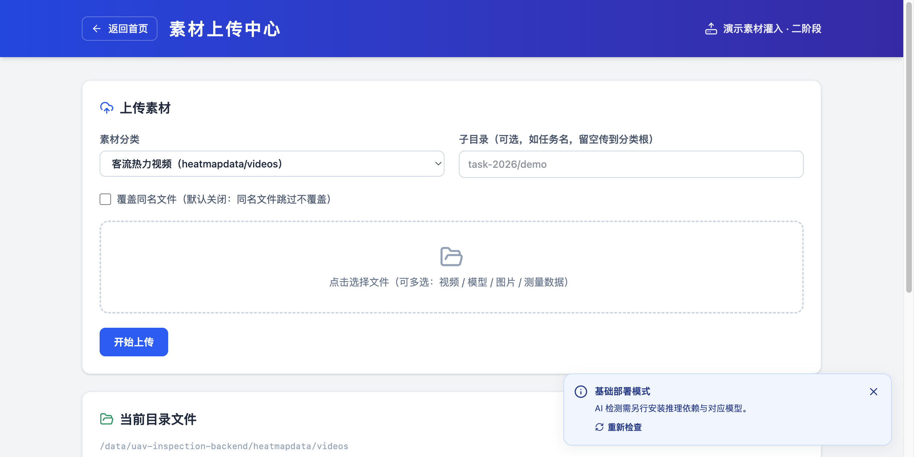
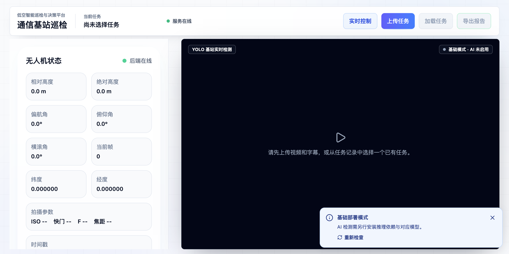
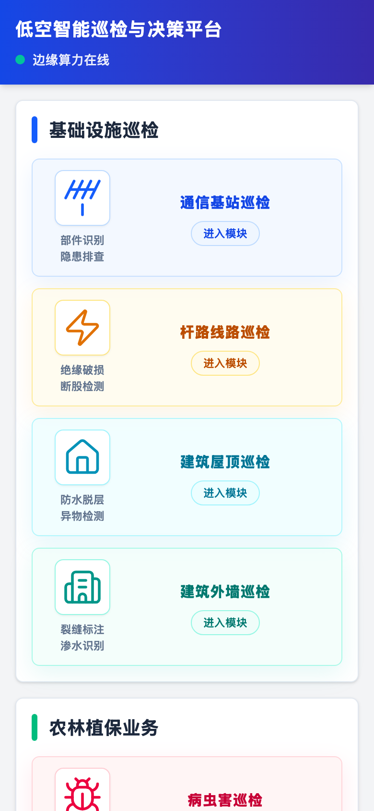
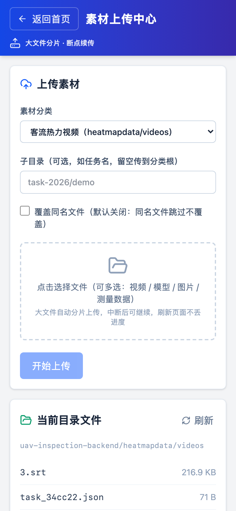
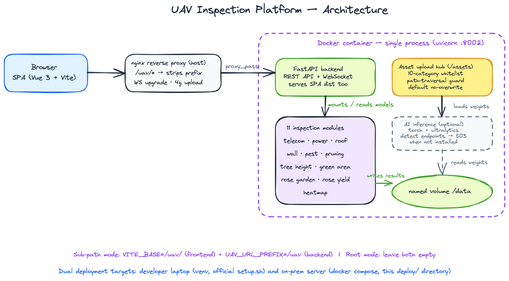

<div align="center">

# 🚁 UAV Inspection Platform

**低空智能巡检与决策平台** — 一个 FastAPI + Vue 3 的无人机巡检演示系统：
单容器部署、11 个业务模块、WebSocket 实时推理流、内置素材上传中心。

[](https://www.python.org)
[](https://fastapi.tiangolo.com)
[](https://vuejs.org)
[](https://vitejs.dev)
[](deploy/)
[](#license)

*首页 · 三大业务分组，11 个巡检模块*



</div>

---

## ✨ 功能模块

| 分组 | 模块 | 能力 |
|---|---|---|
| 🏗️ 基础设施巡检 | 通信基站巡检 | 部件识别、隐患排查（视频 + SRT 字幕联动） |
| | 杆路线路巡检 | 绝缘破损、断股检测 |
| | 建筑屋顶巡检 | 防水脱层、异物检测 |
| | 建筑外墙巡检 | 裂缝标注、渗水识别 |
| 🌱 农林植保业务 | 病虫害巡检 | 智能监测、自动告警、Agent 对话 |
| | 乔木修剪检测 | 修剪识别、状态分析 |
| | 树高测量 / 绿化面积 | 点云测量（PDAL 管线） |
| 🌹 数字园区治理 | 数字玫瑰园 | 全息要素、数字档案（粉黛花场景） |
| | 玫瑰花产量估计 | 产量回归 |
| | 热力客流监测 | 人员分布、聚集预警（实时推理流） |
| 📦 素材管理 | **素材上传中心** | 10 分类白名单上传、子目录组织、防覆盖开关 |

### 设计特点

- **单进程同源架构** — FastAPI 一个进程同时服务 REST API、WebSocket、静态前端与媒体文件，无数据库，数据全部落文件目录
- **AI 可选降级** — 推理依赖（torch/ultralytics）与模型权重缺失时，检测接口返回带提示的 `503`，页面与上传链路照常工作（**基础部署模式**）
- **子路径友好** — 前端构建期 `VITE_BASE` + 后端运行时 `UAV_URL_PREFIX` 双参数化，同一份代码支持根路径与 `/xxx/` 子路径两种挂载方式
- **素材即数据** — 演示素材（视频/模型/测量结果）不进镜像，经上传中心或 API 灌入持久化卷

## 🖼️ 界面一览

| 素材上传中心 | 通信基站巡检 |
|---|---|
|  |  |

*左：`/assets` 上传中心——分类下拉自带目标目录提示；右：巡检工作台——无人机状态面板 + 视频检测区*

### 📱 移动端

响应式布局（PR [#5](https://github.com/thiswind/uav-inspection/pull/5)，感谢 [@rg-ut](https://github.com/rg-ut)），手机浏览器 / 窄窗口直接可用：

| 无人机巡检首页 | 素材上传 | 云锡统一门户 |
|---|---|---|
|  |  |  |

*390×844（iPhone 12 Pro 视口）实拍；两套演示系统均完成移动端适配*

## 🏗️ 架构



```
uav-inspection/
├── app/
│   ├── uav-inspection-backend/     # FastAPI（每模块一个 app 包 + assetsapp 素材中心）
│   │   ├── heatmapapp/             # 主入口 main.py：路由聚合 + SPA 托管 + WebSocket
│   │   ├── assetsapp/              # 二阶段素材上传（分类白名单/防穿越/防覆盖）
│   │   ├── telecomapp/ wallapp/ ...# 各巡检模块（检测接口 + 可选推理）
│   │   ├── uav_url_prefix.py       # UAV_URL_PREFIX 响应体 URL 前缀化（子路径支持）
│   │   ├── optional_inference.py   # AI 可选依赖降级层（无 torch 时 503 提示）
│   │   ├── deployment_paths.py     # 数据目录/前端 dist 路径推导
│   │   └── tests/                  # 官方部署测试 + 素材上传测试
│   └── uav-inspection-ui/          # Vue 3 + Vite + Tailwind + Pinia + ECharts
│       └── src/utils/webroot.ts    # VITE_BASE 前端路径工具（子路径支持）
└── deploy/                         # 服务器部署（Docker Compose 单容器）
    ├── compose.yml                 # 端口/前缀/数据卷均可环境变量覆盖
    ├── docker/Dockerfile           # 多阶段：node 构建 → python 运行时
    ├── nginx/uav-locations.conf    # 子路径反代片段（含 WS upgrade / 大文件上传）
    ├── scripts/build_and_push.sh   # 镜像构建推送（registry 地址可覆盖）
    └── .env.example
```

## 🚀 快速开始

### 方式一：开发者笔记本（venv，适合开发调试）

> 适合 Windows / macOS 本地跑起来看效果。需要 Python 3.10–3.13 与 Node 22.12+。

```bash
# 1) 后端（隔离 venv，不动系统 Python）
cd app/uav-inspection-backend
python -m venv .venv && source .venv/bin/activate      # Windows: .venv\Scripts\activate
pip install -r requirements.txt
python -m uvicorn heatmapapp.main:app --port 8002      # API 文档: http://localhost:8002/docs

# 2) 前端（另一终端；生产模式构建后也由后端托管，开发时用 Vite 热更）
cd ../uav-inspection-ui
npm install
npm run dev                                            # http://localhost:5173
```

> 首次以纯后端方式访问 `http://localhost:8002` 会提示缺少前端构建产物——开发期用 Vite 的 5173 端口即可；或先 `npm run build` 再刷新 8002。
> Windows 下另有官方 `setup.bat` / `start-all-local.bat` 一键脚本（在 `app/` 下）。

### 方式二：服务器（Docker Compose，适合长期演示）

```bash
# 0) 按需修改 deploy/.env（镜像地址/端口/子路径），cp .env.example .env
cd deploy
docker compose up -d
curl http://127.0.0.1:18020/api/health                 # → {"status":"ok"}

# 构建自己的镜像（在前端装好 node 环境的构建机或服务器上）
VITE_BASE=/uav/ bash deploy/scripts/build_and_push.sh  # UAV_REGISTRY 可覆盖 registry 地址
```

### 挂到 nginx 子路径（可选）

反向代理片段见 [deploy/nginx/uav-locations.conf](deploy/nginx/uav-locations.conf)：剥前缀转发 + WebSocket upgrade + 4G 上传限制。要点：

```nginx
location ^~ /uav/ {
    proxy_pass http://127.0.0.1:18020/;        # 尾斜杠 = 剥掉 /uav/ 前缀
    proxy_http_version 1.1;
    proxy_set_header Upgrade $http_upgrade;     # WebSocket（热力图实时流 / 病虫害 Agent）
    proxy_set_header Connection $connection_upgrade;
    client_max_body_size 4g;                    # 演示视频上传
    proxy_buffering off;                        # multipart 推理流
}
```

三处前缀保持一致即可：**nginx 片段**、**前端构建参数 `VITE_BASE=/uav/`**、**后端环境变量 `UAV_URL_PREFIX=/uav`**。全部置空则回到根路径部署（上游原始行为）。

## 📦 素材上传中心（二阶段）

演示素材（巡检视频、SRT 字幕、模型权重、测量结果）**不进镜像**，两种灌入方式：

1. **页面**：部署后访问 `/assets`（首页「素材管理」分组入口），分类下拉自带目标目录提示，默认重名跳过不覆盖
2. **API**：`POST /api/v1/assets/upload`（multipart：`category` + 可选 `subdir` + `files[]`）；`GET /api/v1/assets/categories` 拉分类清单，`GET /api/v1/assets/files?category=...` 看目录内容

安全设计：10 分类**白名单**（未知分类 422）、子目录逐段校验拒路径穿越、文件名 basename + 控制字符清洗、`overwrite=true` 才允许覆盖已有文件。

### 大文件分片上传（断点续传）

1GB+ 的巡检视频走直传极易超时，上传中心内置**分片协议**，前端自动启用：

```
POST /api/v1/assets/upload/init      # 声明文件 → 拿 uploadId / chunkSize / totalChunks
                                      #（同名同大小直接命中「秒传」，不传数据）
GET  /api/v1/assets/upload/status    # 已收分片列表 → 断点续传的依据
POST /api/v1/assets/upload/chunk     # 逐片上传（幂等，重试安全）
POST /api/v1/assets/upload/complete  # 分片齐全+总大小校验后原子合并落盘
```

- 分片大小默认 **8MB**（`UAV_CHUNK_SIZE` 环境变量可调），单请求体积小、单片失败只重传一片
- 页面支持**进度条 / 暂停继续 / 失败重试**；上传中刷新页面，进度仍保留（uploadId 持久化，重选文件自动跳过已传分片）
- 服务端原子合并（临时名 + rename），不产生半文件；废弃分片 7 天自动清理
- nginx 侧无需为总文件大小放宽 `client_max_body_size`——只需覆盖单片

## ✅ 测试

```bash
cd app/uav-inspection-backend

# 官方部署测试（路径推导/数据目录/降级行为）
UAV_DATA_DIR=$(mktemp -d) python -m unittest discover -s tests -p test_optional_deployment.py

# 素材上传中心（白名单/穿越拒绝/防覆盖/清单）
UAV_DATA_DIR=$(mktemp -d) python -m unittest discover -s tests -p test_uav_assets_upload.py

# 分片上传（全流程/断点续传/秒传/竞态去重/参数校验/废弃清理）
UAV_DATA_DIR=$(mktemp -d) python -m unittest discover -s tests -p test_uav_assets_chunked.py

# 前端类型检查 + 构建
cd ../uav-inspection-ui && npm run build
```

> 两套测试请**分开 pattern 跑**：它们都会切换 `UAV_DATA_DIR` 并 import 应用，`deployment_paths` 的模块级路径会被先到者冻结，混跑会互相污染（详见测试文件头注释）。

## 📚 更多文档

| 文档 | 内容 |
|---|---|
| [app/README.md](app/README.md) | 上游交付说明（Windows 一键脚本、模块细节） |
| [app/docs/deployment-verification.md](app/docs/deployment-verification.md) | 部署验收单 |
| [app/docs/api.md](app/docs/api.md) | API 说明（另可看运行时的 `/docs` OpenAPI） |
| [docs/architecture.excalidraw](docs/architecture.excalidraw) | 架构图源文件（可用 Excalidraw 编辑） |

## License

MIT
